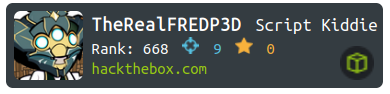

# 2023-04-02

---

## Training Hacking Skills

`https://app.HackTheBox.com`

- Finished - Precious - Easy Box
- Finished - Soccer - Easy Box
- Finished - Stocker - Easy Box

---

## Testing a tool to automate some HTB related tasks

`https://github.com/0x4xel/HTNotes`

- Automatic box information gathering from HTB website using HTB API
- Generate files and directories inside an Obsidian Vault.
- Input the Machine's Name you want to have a new folder and files for documenting the complete hacking methodology used to get root.  The script auto get box info and all metadata and the images from HTB website and you are all set up to go hack.  This tool is making the note taking and report writing simpler and in a standardized way. It's a good idea and practice to take detailed notes when testing HackTheBox machines.
Files and directories : /Dashboard/HTB-Machine-Name/ (asset, 00-index,01-recon, 02-exploitation, 03-post-exploitation)
- Index - Dashboard of all saved stats from HTB labs 
- A diagram template of a visual note describing the attacker methodology
- Templates for recon phase
- Templates for exploitation phase
- Templates for post-exploit phase

==TODO==
Write a text about this on medium.

---

## Generating AI Text-to-Image

`https://nightcafe.studio`

-Made a cleanup of My Creations, archived old pictures, tagged untagged, create Collections and move files
-Generate an entry for the Daily Challenge - Fantasy Landscapes
-Vote on 20 pictures from Daily Challenge - Steampunk

--

## Reading about testing Git Version Control in VSCode

-See how to manage a website using VSCode
-Cloning my personals GitHub repositories and putting them on a backup drive in case I break something
-Planning folder management for : My study notes, My Creations, "Daily progression", [ ], [ ], ...

---

## Testing a script to generate a Hackthebox Profile Badge (To use on my media)

`https://github.com/HTB-HDBadgeGenerator`

==TODO==
Write about it.

---
