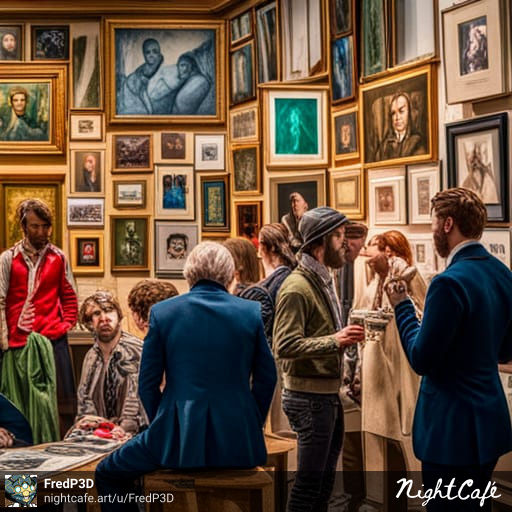

# 2023-04-11

---

## Learning Cybersecurity - (ISC)2 -- CC Certification

`https://learn.isc2.org`

- Finished Chapter 1 - Module 3-4-5-6

### **Final Score: 90/100**

- Started the Chapter 2:  Incident Response, Business Continuity and Disaster Recovery Concepts

---

## Training my hacking skills on HackTheBox

`https://app.hackthebox.com`

- Try to do the season weekly box "Busqueda".  Hit a wall and decided to leave it be for tonight.   I need to do some research because I'm clueless on how to get initial foothold.

## Having fun generating AI pictures

`https://nightcafe.studio`

- Made a picture for the Daily Challenge - NightCafe :

## Learning Python

`https://tryhackme.com`

- Finished the room "Python Basics".

---
