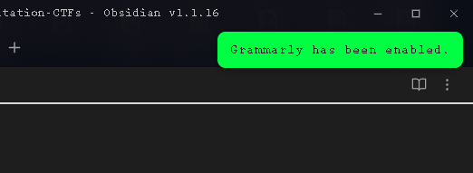

# 2023-04-22

---

## Reading about AI training

==PROJECT==
Train an AI using my Calibre e-book library (300+ Computer Science, Python and Hacking Books) to find information (text, image, code snippet, …) that I know is written somewhere in one of these books.  

---

## Using Stable Diffusion to generate pictures

`https://nightcafe.studio`

-Submitted my entry for the Daily Challenge - Robot holding a sign.

---

## Learning about Jupyter Notebooks

`https://tryhackme.com/room/jupyter101`

- Finished the "Jupyter 101" room.  Really interesting.
- ***Microsoft Learn - Introduction to Python is build with this.***

### ==**---------------NMI--------------------**==

- Explore some: [Notebooks that people have made](https://github.com/jupyter/jupyter/wiki/A-gallery-of-interesting-Jupyter-Notebooks)

==**------------------------------------------**==

---

## Adding ChatGPT inside Obsidian

==**DONE!**== - I am able to interact with ChatGPT directly inside Obsidian.  It's nice to have this when needed.  Not hard to do at all by the way.  Get the plugin, put the ChatGPT API Key and ***Voila!***

---

## Trying to get the Obsidian Grammarly plugin to work

- So far, no luck...  There are working examples on GitHub and...I'll take a break for now. I'm missing something...

- ==**DONE!**== 1 hour later : There is a small icon that wasn't there before... "ENABLE GRAMMARLY".  I feel a little dumb right now.

---
