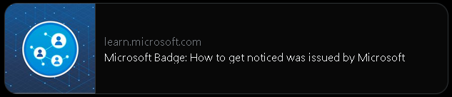
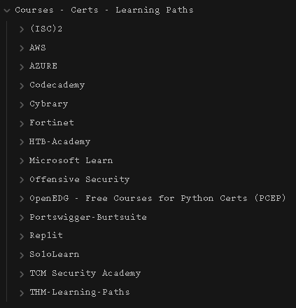

# 2023-04-24

## Learning about resume building and networking

`Microsoft Learn`

- Finished the "Microsoft Badge: How to get noticed"
* Resume Building
* LinkedIn profile creation
* Networking

---

## Organizing up my note system

`Obsidian Vault - Hacking-Learning-CTF`

- Final Folder System with 8 main categories subdivided into sub-categories.  I add another sub-folder as I need it.

### Main Categories - 8 Folders

==Subcategories for Courses==

[Open file:](_attachment/692437ca17db5db3da301ed4c5307527_MD5.png)

There is another layer inside each Learning resource