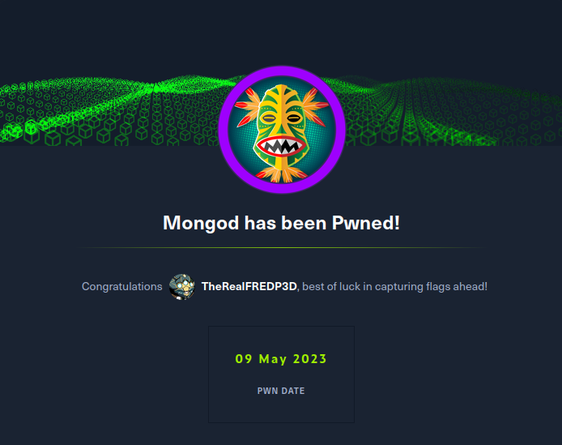

# Daily Notes - IT, Cybersecurity 2023-05-08

---
## Summary of Completed Tasks:

-   Task 1: Training hacking skills
`app.HackTheBox.com`

I got myself a VIP subscription.  
I have now access to a lot of new challenges and learning resources.

---

-   Task 2: Training hacking skills

I completed the Starting-Point "Explosion" box.

---

-   Task 3: Training Hacking skills
`app.hackthebox.com`

- Finished the Starting-Point box: "Preignition"

---

-   Task 4: Training Hacking skills
`app.hackthebox.com`

- Finished the Starting-Point box: "Mongod"

---

Task 5: Generating picutures using AI
`nightcafe.studio`

- Submitted my entry for the Daily Challenge : "Clowns"

---

## Challenges Faced:

-   [Description of challenge faced]
-   [Solution to challenge]

---

## New Information Learned:

-   [Information learned]
-   [Source of information]

---

## Action Items for Tomorrow:

-   Task 1

-   Task 2

-   Task 3
